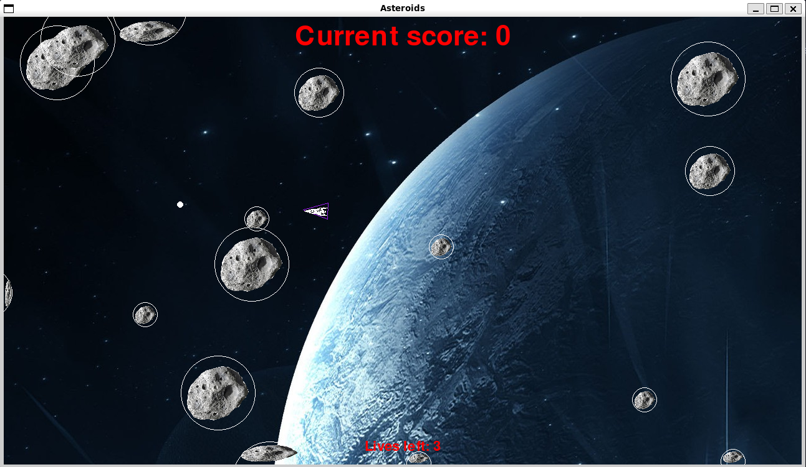

# Asteroids



## How to run

Create a Python environment in which ever way you want (Anaconda, venv, etc.), making sure that you have pip. Then if you're on a unix or mac machine, you should be able to run the below command to play the game.

```bash
./run.sh
```

## Why
This was a project for [boot.dev](boot.dev) to use concepts of object oriented programming to make a game with many objects.

## Lessons learned

- This project taught me how to use objects that use inheritance (such as both the `Player` and `Asteroid` classes inherit from the `CircleShape` class, which inherits from `pygame.sprite.Spite` class)
- Managing the different states of objects (such as the different state of each asteroid)
- Using images and scaling them
- Running into weird quirks with different operating systems
    - Initially I created the program on a Windows 10 machine under WSL (using Ubuntu), but when I moved my repo to my Fedora 40 machine performance was adysmal (part of which is due to the age of the Fedora machine)
